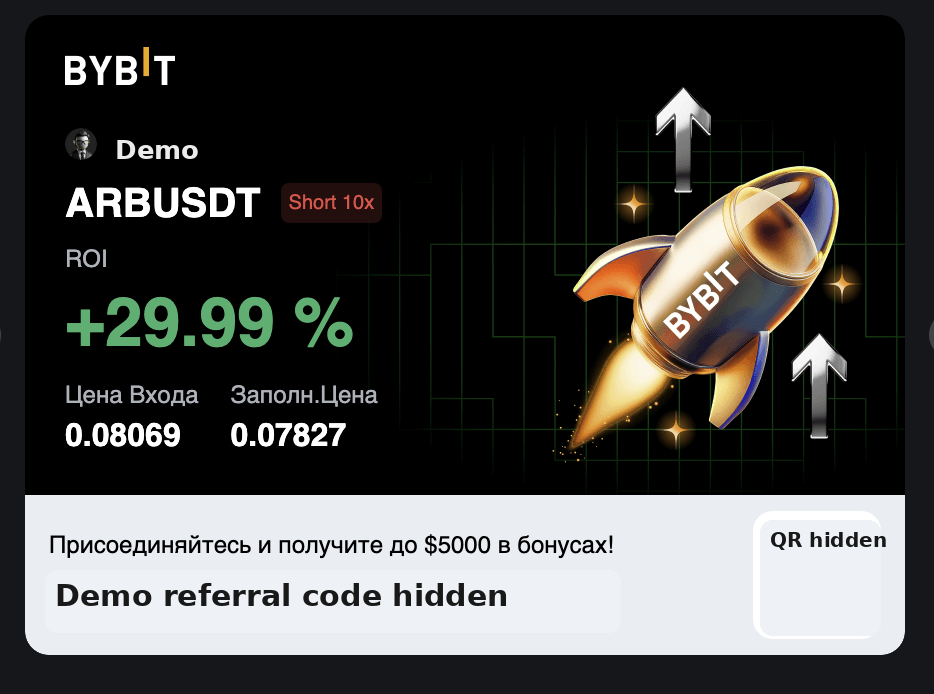
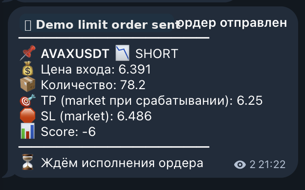
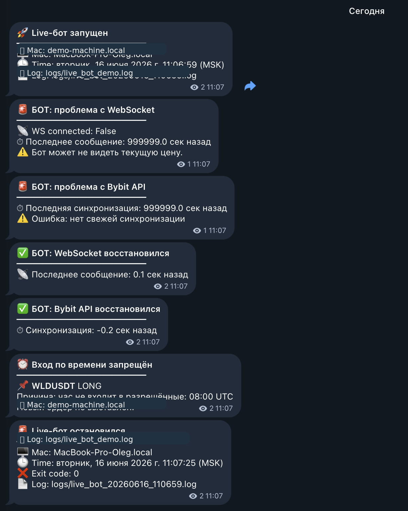
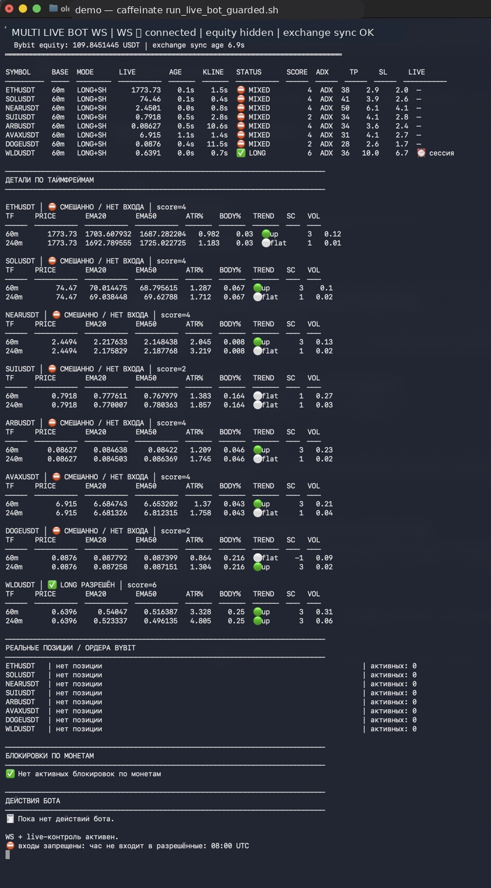

# 📈 Bybit Trading Bot — Paper & Live Mode

Python trading bot for Bybit with paper trading, WebSocket market data, configurable symbols, risk controls, trade logging, and optional live trading mode.

> ⚠️ This repository is for educational and portfolio purposes. It is not financial advice and does not guarantee profit.

## 🇬🇧 Short Description

**Bybit Trading Bot — Paper & Live Mode** is a Python-based trading automation project.

The bot is designed to process market data from Bybit, run a configurable trading strategy, manage risk limits, log trades, and support both safe paper trading and optional live trading.

The main focus of this repository is **architecture, risk management, configuration handling, and safe trading automation practices**.

---

## 🇷🇺 Краткое описание

**Bybit Trading Bot — Paper & Live Mode** — это Python-проект торгового бота для Bybit.

Бот получает рыночные данные, применяет настраиваемую торговую стратегию, контролирует риски, пишет сделки в лог и поддерживает безопасный paper trading, а также опциональный live-режим.

Основной фокус проекта — **архитектура, риск-менеджмент, конфигурация и безопасная автоматизация торговли**.

---

## 🖼️ Demo Screenshots

### Bybit result card



### Live order alert



### Bot monitoring alerts



### Live terminal dashboard



More details: [`docs/demo-screenshots.md`](docs/demo-screenshots.md)

---

## ✨ Features

- Paper trading mode
- Optional live trading mode
- Bybit WebSocket market data
- Multi-symbol configuration
- Risk management layer
- Trade logging
- Demo CSV output
- Environment-based secrets
- Safe public configuration examples

---

## 🧩 Architecture

```text
Bybit WebSocket Market Data
        ↓
Market Data Handler
        ↓
Strategy Logic
        ↓
Risk Manager
        ↓
Order Executor
        ↓
Paper Trading / Live Trading
        ↓
Trade Logger
```

More details: [`docs/architecture.md`](docs/architecture.md)

---

## 🛠️ Tech Stack

- Python
- Bybit API / WebSocket
- JSON configuration
- CSV trade logs
- Environment variables

---

## 📁 Repository Structure

```text
bybit-trading-bot-paper-live/
├── README.md
├── LICENSE
├── .gitignore
├── .env.example
├── docs/
│   ├── architecture.md
│   ├── setup-checklist.md
│   ├── risk-disclaimer.md
│   ├── security.md
│   ├── demo-screenshots.md
│   └── screenshots/
│       ├── 01-bybit-result-card.png
│       ├── 02-live-order-alert.png
│       ├── 03-bot-monitoring-alerts.png
│       └── 04-live-terminal-dashboard.png
├── src/
│   ├── multi_paper_bot_ws.py
│   ├── multi_live_bot_ws.py
│   ├── strategy.py
│   ├── risk_manager.py
│   └── config_loader.py
├── config/
│   └── symbol_config.example.json
├── data/
│   └── paper_trades_demo.csv
└── examples/
    └── sample_output.md
```

---

## ⚙️ Setup Outline

1. Create a local `.env` file from `.env.example`.
2. Configure Bybit API keys locally only.
3. Configure symbols in `config/symbol_config.example.json`.
4. Start with paper trading mode.
5. Review trade logs.
6. Test risk limits.
7. Use live trading only after full local testing.

---

## 🔐 Security Notes

Never commit:

- Bybit API key
- Bybit API secret
- `.env` files with real values
- real account IDs
- real balances
- real order IDs
- real wallet data
- private logs

Use `.env.example` and demo CSV files only.

See: [`docs/security.md`](docs/security.md)

---

## ⚠️ Risk Disclaimer

Trading cryptocurrency involves significant risk. Automated trading can lose money quickly due to market volatility, bugs, exchange issues, network problems, or incorrect configuration.

This repository does not provide financial advice.

See: [`docs/risk-disclaimer.md`](docs/risk-disclaimer.md)

---

## 📌 Project Tagline

**English:**  
Python Bybit trading bot with paper trading, WebSocket market data, risk controls and optional live mode.

**Russian:**  
Python-бот для торговли на Bybit с paper trading, WebSocket-данными, риск-контролем и опциональным live-режимом.
