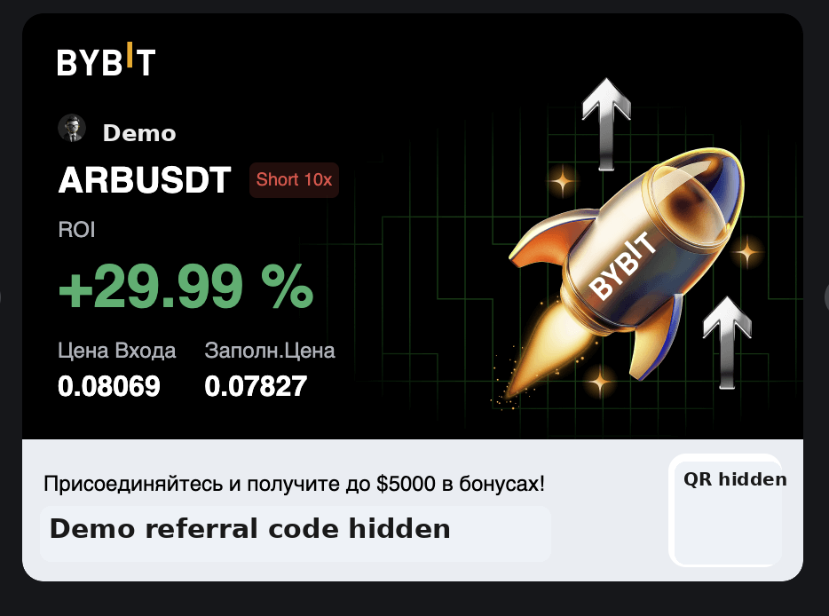
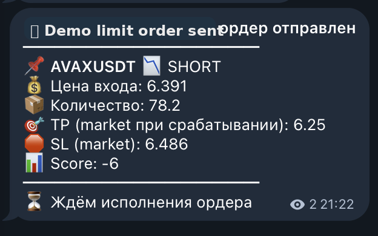
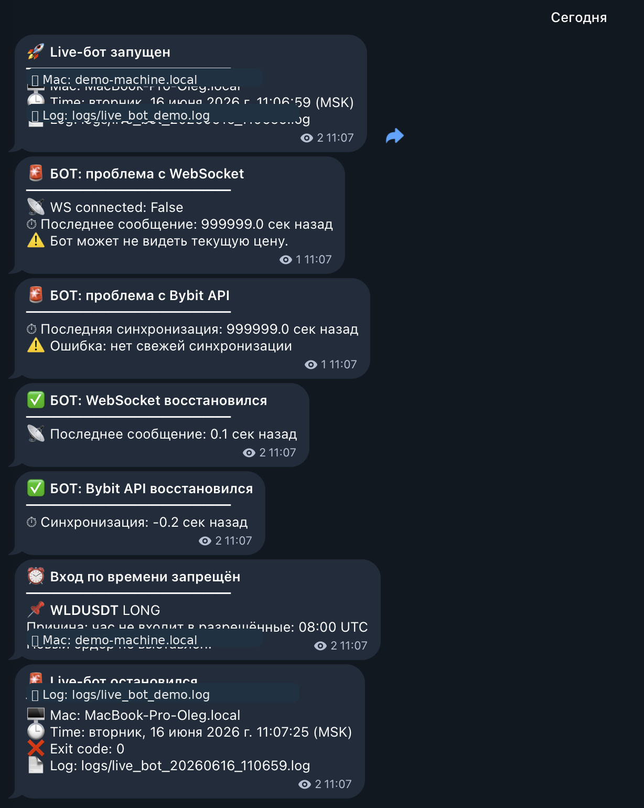
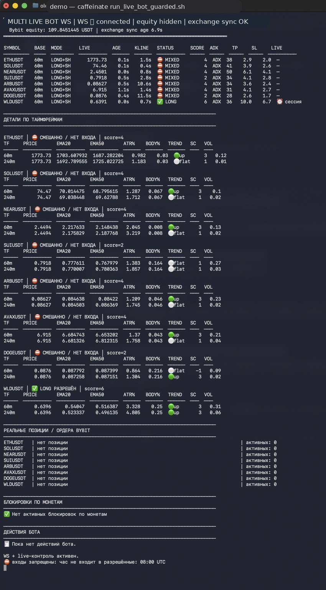

# 📈 Bybit Trading Bot — Paper & Live Mode

Python trading bot for Bybit with paper trading, WebSocket market data, configurable symbols, risk controls, trade logging, and optional live trading mode.

> ⚠️ This repository is for educational and portfolio purposes. It is not financial advice and does not guarantee profit.

## 🇬🇧 Short Description

**Bybit Trading Bot — Paper & Live Mode** is a Python-based trading automation project.

The bot is designed to process market data from Bybit, run a configurable trading strategy, manage risk limits, log trades, and support both safe paper trading and optional live trading.

The main focus of this repository is **architecture, risk management, configuration handling, and safe trading automation practices**.

---

## 🇷🇺 Краткое описание

**Bybit Trading Bot — Paper & Live Mode** — это Python-проект торгового бота для Bybit.

Бот получает рыночные данные, применяет настраиваемую торговую стратегию, контролирует риски, пишет сделки в лог и поддерживает безопасный paper trading, а также опциональный live-режим.

Основной фокус проекта — **архитектура, риск-менеджмент, конфигурация и безопасная автоматизация торговли**.

---

## 🖼️ Demo Screenshots

### Bybit result card



### Live order alert



### Bot monitoring alerts



### Live terminal dashboard



More details: [`docs/demo-screenshots.md`](docs/demo-screenshots.md)

---

## ✨ Features

- Paper trading mode
- Optional live trading mode
- Bybit WebSocket market data
- Multi-symbol configuration
- Risk management layer
- Trade logging
- Demo CSV output
- Environment-based secrets
- Safe public configuration examples

---

## 🧩 Architecture

```text
Bybit WebSocket Market Data
        ↓
Market Data Handler
        ↓
Strategy Logic
        ↓
Risk Manager
        ↓
Order Executor
        ↓
Paper Trading / Live Trading
        ↓
Trade Logger
```

More details: [`docs/architecture.md`](docs/architecture.md)

---

## 🛠️ Tech Stack

- Python
- Bybit API / WebSocket
- JSON configuration
- CSV trade logs
- Environment variables

---

## 📁 Repository Structure

```text
bybit-trading-bot-paper-live/
├── README.md
├── LICENSE
├── .gitignore
├── .env.example
├── docs/
│   ├── architecture.md
│   ├── setup-checklist.md
│   ├── risk-disclaimer.md
│   ├── security.md
│   ├── demo-screenshots.md
│   └── screenshots/
│       ├── 01-bybit-result-card.png
│       ├── 02-live-order-alert.png
│       ├── 03-bot-monitoring-alerts.png
│       └── 04-live-terminal-dashboard.png
├── src/
│   ├── multi_paper_bot_ws.py
│   ├── multi_live_bot_ws.py
│   ├── strategy.py
│   ├── risk_manager.py
│   └── config_loader.py
├── config/
│   └── symbol_config.example.json
├── data/
│   └── paper_trades_demo.csv
└── examples/
    └── sample_output.md
```

---

## ⚙️ Setup Outline

1. Create a local `.env` file from `.env.example`.
2. Configure Bybit API keys locally only.
3. Configure symbols in `config/symbol_config.example.json`.
4. Start with paper trading mode.
5. Review trade logs.
6. Test risk limits.
7. Use live trading only after full local testing.

---

## 🔐 Security Notes

Never commit:

- Bybit API key
- Bybit API secret
- `.env` files with real values
- real account IDs
- real balances
- real order IDs
- real wallet data
- private logs

Use `.env.example` and demo CSV files only.

See: [`docs/security.md`](docs/security.md)

---

## ⚠️ Risk Disclaimer

Trading cryptocurrency involves significant risk. Automated trading can lose money quickly due to market volatility, bugs, exchange issues, network problems, or incorrect configuration.

This repository does not provide financial advice.

See: [`docs/risk-disclaimer.md`](docs/risk-disclaimer.md)

---

## 📌 Project Tagline

**English:**  
Python Bybit trading bot with paper trading, WebSocket market data, risk controls and optional live mode.

**Russian:**  
Python-бот для торговли на Bybit с paper trading, WebSocket-данными, риск-контролем и опциональным live-режимом.

Maintenance note: verify rejected orders are clearly recorded as rejected and never counted as open positions.

Maintenance note: confirm paper-mode logs never contain live account identifiers before publishing examples.

Maintenance note: confirm the configured symbol list is reviewed before every live-mode session.

Maintenance note: verify WebSocket reconnects restore subscriptions without duplicating local position state.

Maintenance note: verify system clock synchronization before live-mode sessions so signed API requests use valid timestamps.

Maintenance note: confirm live mode cannot start when required risk-limit configuration is missing or invalid.

Maintenance note: keep paper and live trade logs clearly separated so demo results cannot be mistaken for real-account activity.

Maintenance note: review live-session logs for unexpected retries or duplicate order attempts before the next run.

Maintenance note: confirm live API keys use only the minimum permissions required for trading and never withdrawal access.

Maintenance note: document whether each setup example targets testnet or mainnet so portfolio users cannot confuse the environments.

Maintenance note: confirm portfolio screenshots never expose live balances, wallet values, or account identifiers.

Maintenance note: reject non-finite or negative numeric risk settings during config loading before paper or live execution begins.

Maintenance note: capture a sanitized risk-configuration snapshot before each live session so later log review can verify the intended limits.

Maintenance note: verify the exchange-reported position state matches local state before enabling a new live session after restart.

Maintenance note: record a non-sensitive configuration fingerprint for each live session so later logs can be matched to the reviewed settings without storing secrets.

Maintenance note: require a fresh reconciliation of open orders and positions immediately before switching from paper mode to live execution.

Maintenance note: invalidate any prior live-session readiness marker if symbol, leverage, or risk settings change after reconciliation.

Maintenance note: expire live-session readiness after a short documented interval so a stale reconciliation cannot authorize later execution.

Maintenance note: immediately before any live order, confirm the current exchange symbol status is tradable and matches the reconciled configuration.

Maintenance note: verify a paper-mode retry after stale market data starts from a fresh snapshot and cannot inherit a prior readiness result.

Maintenance note: after reconnect, discard any in-flight readiness result that completed against the previous connection generation.

Maintenance note: invalidate readiness when instrument filters refresh, even if the symbol name is unchanged, so sizing always uses one current metadata snapshot.

Maintenance note: before live submission, reject a stale readiness result if order type, time-in-force, reduce-only, or instrument metadata changed; recalculate sizing and price/quantity rounding against one current snapshot.

Maintenance note: verify a rejected live submission records the reason without creating a local open-position record.

Maintenance note: verify a rejected live order leaves both exchange state and the local open-position state unchanged.

Maintenance note: verify changing reduce-only invalidates live readiness before order submission.

Maintenance note: verify live price and quantity rounding use the same current instrument metadata snapshot as readiness validation.

Maintenance note: after reconnect, verify readiness results from the previous connection generation cannot authorize a live order.

Maintenance note: verify a rejected reduce-only live order records the reason without creating or changing a local position.

Maintenance note: verify stale market data blocks live submission before sizing, rounding, or local position state is created.

Maintenance note: verify the market-data timestamp is rechecked immediately before live submission and stale snapshots fail closed.

Maintenance note: verify a reconciled live-order retry reuses the original client order identifier instead of creating a second intent.

Maintenance note: after a live-order timeout, reconcile exchange open orders by client identifier before any retry.

Maintenance note: document the startup reconciliation order for positions, open orders, and local strategy state before enabling new live orders.

Maintenance note: verify paper and live modes are clearly identified in startup logs and exported execution summaries.

Maintenance note: document price and quantity precision rounding before order validation in both paper and live modes.

Maintenance note: document clock-skew handling and the safe response when an exchange rejects a stale request timestamp.

Maintenance note: document the shutdown fail-safe for cancelling open orders and confirming the final exchange state.

Maintenance note: document startup validation for position size, leverage, and loss limits before live trading is enabled.

Maintenance note: document the market-data freshness threshold that blocks new orders when quotes become stale.

Maintenance note: document the safe trading pause used during exchange maintenance or degraded API status.

- Document order-state handling for partial fills so cancellation and position reconciliation remain deterministic.

- Document how duplicate exchange events are detected before updating local order and position state.

- Document the reconciliation rule used when local order state conflicts with the exchange's final status.

- Document the maximum age allowed for account-balance data before a new order is rejected as unsafe.

- Document how the bot distinguishes exchange rejection, timeout, and unknown order status before any retry.

- Document the safe startup behavior when open orders exist for symbols excluded by the current configuration.

- Document how risk limits are revalidated immediately before submitting an order after a delayed market-data response.

- Document how partial position closures update remaining risk and protective-order expectations.

- Document how protective orders are checked after reconnecting to the exchange following a network interruption.

- Document how stale websocket events are rejected after a successful account-state resynchronization.

- Document how order sizing is rechecked after a partial fill changes available balance or exposure.

- Document how protective-order quantities are revalidated after a partial position close.

- Document the circuit-breaker behavior used after repeated order rejections in live mode.
